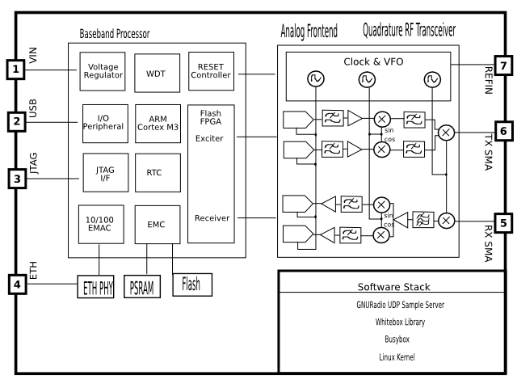

**Features**

**Hardware**

* Quadrature receiver from 50MHz to 1000MHz
* Quadrature transmitter from 50MHz to 1000MHz
* Half-duplex
* 1MHz bandwidth
* 10 MS/s, 10 bit ADC & DAC
* 16MB SDRAM, 16MB Flash
* 3.3V low power operation
* 100mA sleep state, 500mA transceiving

**Interfaces**

* UART over USB
* 10/100 Ethernet
* ARM & FlashPro JTAG
* 1 I2C, 1 SPI, 1 UART, 1 ADC, 16 GPIO

**Software**

* uClinux 2.6.xx + Busybox from Emcraft Systems
* Digital Signal Processing Chain for RF
* Platform and Character Drivers for RF Board
* Userspace control libraries and examples
* GNURadio drivers

**Applications**

* Analog/digital multimode radio
* Software deifined radio
* Battery powered baseband modems
* Portable, mobile and base station terminals
* Satellite communications
* Amateur radio
* Police and commercial radio

**General Description**

The Whitebox Bravo is an embeddable software radio framework with a small
footprint and power profile, similar to the requirements of a smartphone
cellular radio architecture.  At the core is a customizable System on a Chip
with both an ARM Cortex-M3 running uClinux and a Flash based FPGA.  Paired with
a highly integrated frequency agile radio frontend.  The module boasts very low
static power dissapation for effective duty cycling in battery operated situations.
Supports GNURadio over UDP in Peripheral mode for rapid development.  Embed and
augment the system with a full suite of embedded communication methods including 
I2C, SPI, UART, ADCs, and GPIOs.

**Signals**

1. Input Voltage (VIN).  Battery, car, or USB powered.
2. I/O Peripheral (USB).  Busybox shell accessable over USB.  I2C, SPI, UART, GPIOs available for expansion.
3. JTAG Debugging (JTAG).  Debug both the ARM core and FPGA via JTAG.
4. 10/100 Ethernet (ETH). Supports TFTP boot, NFS mount, and GNURadio over UDP.
5. Receiver (RX SMA).  Receive antenna SMA.
6. Transmitter (TX SMA).  Transmit antenna SMA.
7. 10MHz Reference (REFIN).  External 10MHz reference input SMA.

**Functional Block Digram**

